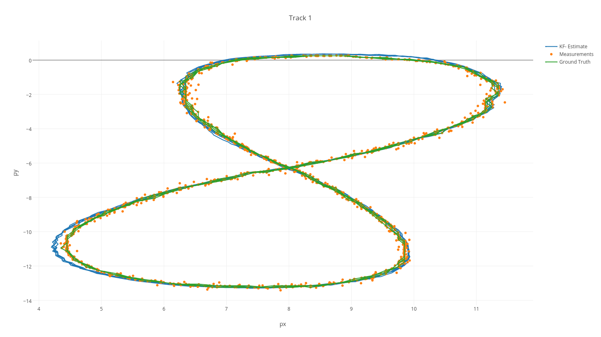

# Extended Kalman Filter Project
Self-Driving Car Engineer Nanodegree Program

---

## Summary

This project implements a sensor fusion scheme for lidar and radar data.
It uses the kalman filter and extended Kalman filter for laser and radar measurements respetively.

The exteneded Kalman filter is used in the radar data because transfer function for the radar is not linear.

This is how the information is processed:

## Code Style

Please (do your best to) stick to [Google's C++ style guide](https://google.github.io/styleguide/cppguide.html).

## Dataset #1

## Dataset #2

## Dependencies

* cmake >= 3.5
* make >= 4.1
* gcc/g++ >= 5.4

## Basic Build Instructions

1. Clone this repo.
2. Make a build directory: `mkdir build && cd build`
3. Compile: `cmake .. && make`
4. Run it: `./ExtendedKF path/to/input.txt path/to/output.txt`. You can find
   some sample inputs in 'data/'.
    - eg. `./ExtendedKF ../data/sample-laser-radar-measurement-data-1.txt output.txt`

## Project Instructions and Rubric

Note: regardless of the changes you make, your project must be buildable using
cmake and make!

## Hints!

* You don't have to follow this directory structure, but if you do, your work
  will span all of the .cpp files here. Keep an eye out for TODOs.

### External Refernces

#### Tutorial for Eigen library.
[https://eigen.tuxfamily.org/dox/group__TutorialMatrixClass.html](https://eigen.tuxfamily.org/dox/group__TutorialMatrixClass.html)
#### Fragment from Nort Carolina University
[http://www.cs.unc.edu/~tracker/media/pdf/SIGGRAPH2001_CoursePack_08.pdf](http://www.cs.unc.edu/~tracker/media/pdf/SIGGRAPH2001_CoursePack_08.pdf)

[http://www.cs.unc.edu/~welch/kalman/media/pdf/maybeck_ch1.pdf](http://www.cs.unc.edu/~welch/kalman/media/pdf/maybeck_ch1.pdf)

#### This book has some ideas on how to tune a Kalman filter.
Introduction to Random Signals and Applied Kalman Filtering with Matlab( Robert Brown)
